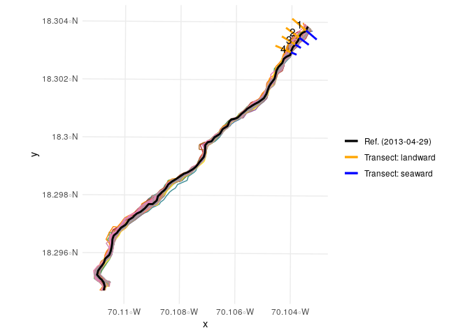
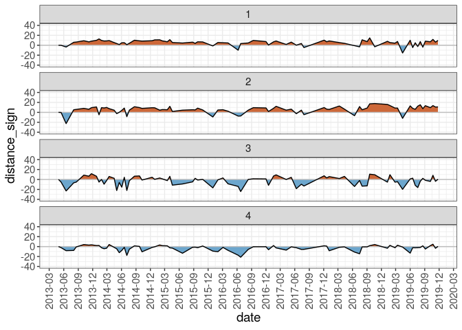

RCoastSat
================

<!-- README.md is generated from README.Rmd. Please edit that file -->
Packages
--------

``` r
library(tidyverse)
library(purrr)
library(sf)
library(RColorBrewer)
```

Read the functions
------------------

``` r
funs <- list.files('R', pattern = '*.R', full.names = T)
map(funs, source)
```

Import/plot transects and shorelines
------------------------------------

``` r
shl <- rshl('data/najayo-l8-shorelines.geojson') %>% mutate(date=as.Date(date)) #Shorelines
## Reading layer `najayo-l8-shorelines' from data source `/home/jose/Documentos/git/RCoastSat/data/najayo-l8-shorelines.geojson' using driver `GeoJSON'
## Simple feature collection with 80 features and 4 fields
## geometry type:  LINESTRING
## dimension:      XY
## bbox:           xmin: 382567.5 ymin: 2023148 xmax: 383401.9 ymax: 2024170
## CRS:            32619
refl <- shl %>% filter(date==min(date)) #Reference shoreline
rawtrans <- rtrans('data/transects.geojson') #Raw transects
## Reading layer `transects' from data source `/home/jose/Documentos/git/RCoastSat/data/transects.geojson' using driver `GeoJSON'
## Simple feature collection with 4 features and 1 field
## geometry type:  LINESTRING
## dimension:      XY
## bbox:           xmin: 383261.1 ymin: 2024048 xmax: 383418.5 ymax: 2024186
## CRS:            32619
trans <- transclas(tr = rawtrans, rl = refl) #Transects classified by seaward/landward sections
## Warning: attribute variables are assumed to be spatially constant
## throughout all geometries

## Warning: attribute variables are assumed to be spatially constant
## throughout all geometries
## Warning in st_cast.sf(tmultiline, "LINESTRING"): repeating attributes for
## all sub-geometries for which they may not be constant
cols <- colorRampPalette(brewer.pal(9,'Set1'))(nrow(shl))
ggplot() +
  geom_sf(data = shl %>% mutate(date = factor(date)), color = cols) +
  geom_sf(
    data = refl %>% mutate(linetype = paste0('Ref. (', date, ')')),
    aes(color=linetype), lwd = 1, show.legend = 'line') +
  geom_sf(
    data = trans %>% mutate(sealand=paste0('Transect: ', sealand)),
    aes(color = sealand), show.legend = 'line', lwd = 1) +
  scale_color_manual(values = c('black', 'orange', 'blue')) +
  geom_sf_text(
    data = trans %>% filter(sealand=='landward') %>%
      st_centroid, aes(label = transect), size = 4) +
  theme_minimal() +
  theme(legend.title = element_blank())
## Warning in st_centroid.sf(.): st_centroid assumes attributes are constant
## over geometries of x
```



Extract points at interserctions and calculate distances
--------------------------------------------------------

``` r
distl <- pointdist(sh = shl, re = refl, tr = trans, rtr = rawtrans)
## Warning: attribute variables are assumed to be spatially constant
## throughout all geometries

## Warning: attribute variables are assumed to be spatially constant
## throughout all geometries
```

Time-series of shoreline change for each transect
-------------------------------------------------

> Increase the `fig.height` parameter in the chunk header to make room for facets with more than 5 shoreline change transects. For example, use `fig.height=20` when plotting 10 shoreline change transects.

``` r
interdist <- map(distl, interpolate) %>% plyr::ldply()
distances <- plyr::ldply(distl)
distances %>% 
  ggplot() + theme_bw() + aes(x = date, y = distance_sign) +
  geom_ribbon(data = interdist, aes(ymax = pmax(distance_sign, 0), ymin = 0), fill = "sienna3") +
  geom_ribbon(data = interdist, aes(ymin = pmin(distance_sign, 0), ymax = 0), fill = "skyblue3") +
  geom_hline(yintercept = 0, color = 'grey') +
  geom_line(colour='black', lwd = 0.5) +
  scale_x_date(labels = scales::date_format("%Y-%m"), date_breaks = '3 months') +
  scale_y_continuous(limits = c(-30, 30)) +
  theme(axis.text.x = element_text(angle = 90, vjust = 0.5), text = element_text(size = 14)) +
  facet_wrap(~transect, ncol = 1)
```


